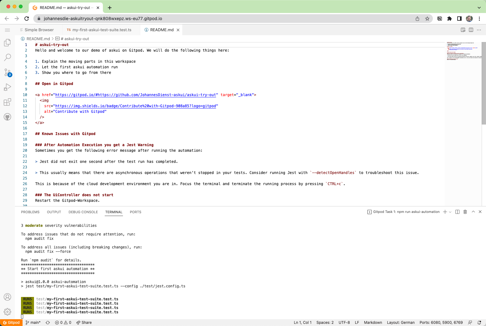
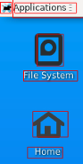

[](https://gitpod.io/#workspaceid=d928f70b-7ff0-4cea-b9f6-c6522a2eb492,accesstoken=F-mBwv7ykeSgZjCwpNjv/https://github.com/askui/askui-try-out)

# askui-try-out
Welcome to our demo of askui on Gitpod. We will do the following things:

1. Explain the moving parts
2. Open the GUI of the workspace
3. Observe first askui automation run
4. Show you where to go from there

When you are ready open this repository in Gitpod with this button:

[](https://gitpod.io/#workspaceid=d928f70b-7ff0-4cea-b9f6-c6522a2eb492,accesstoken=F-mBwv7ykeSgZjCwpNjv/https://github.com/askui/askui-try-out)

## Moving Parts of This Workspace

First, we will tidy up your workspace as the Visual Studio Code Editor in your browser is cluttered:

* Hide Sidebar: press `CTRL + b` (`COMMAND + b` on macOS)
* Remove _Get Started_ tab: Left click on the _x_ beneath the tab

Your browser window should look like this afterward:



## Open the GUI of the workspace

On startup of this workspace, askui gets installed in the background and the first automation already started!

Click on the tab _Simple Browser_ to see this workspace's GUI (Linux Desktop). What you see is like a real GUI from a physical device, but in the cloud. If you see red boxes like the one in the next picture around elements, it means the automation is ready to run:



You can also resize the tab to have a better viewing experience.

## Observe First askui Automation Run

Click in the _Simple Browser_ tab to get the focus into the GUI. Then press `ESC` on your keyboard and observe that askui moves the mouse, opens Google Chrome, and navigates to a webpage by typing in the URL and pressing `ENTER` on your keyboard. In between there should be same popups that get clicked away 😉

For better understanding:

> askui automates your Operating System as a real human would! With real mouse movement, keystrokes, and visual selection of elements.

If you want to know how the code looks to achieve this, click on the tab _my-first-askui-test-suite.test.ts_ to see the code with comments for each command.

## Where To Go Now
You have now seen what simple automation in a remote cloud environment can do.

Head over to our [User Portal](http://app.v2.askui.com/) to register (and use) askui for free on your local machine.

For local installation follow the _Onboarding Guide_ there or head over to [our docs Getting Started](https://docs.askui.com/docs/general/Getting%20Started/getting-started).

If you need more inspiration we have the following resources for you:

* [Tutorials](https://docs.askui.com/docs/general/Tutorials/google-cat-search)
* [Flutter Example Repository](https://github.com/askui/flutter-example-automation)
* [Example Automations on Github](https://github.com/askui/askui-examples)

And our [Discord-Community](https://discord.gg/KFYJ5xuyBA) to answer any questions.

## How to Start with a workspace id and access token?

* Replace `<your workspace id>` and `<your access token>` with your `workspace id` and your `access token` in the link below.
* Then open the link in your browser
* Your `workspace id` and your `access token`

> **DISCLAIMER: Do not publish the link publicly as it contains your unencrypted credentials!**

`https://gitpod.io/#workspaceid=<your workspace id>,accesstoken=<your access token>/https://github.com/askui/askui-try-out`

## Known Issues with Gitpod

## I Closed the Simple Browser Window / It is not visible
Go to the ports tab and reopen it as preview or in a separate browser window


## Simple Browser Tab/Window does not react to Keystrokes/Clicks
Restart the Gitpod-Workspace.

### After Automation Execution you get a Jest Warning
Sometimes you get the following error message after running the automation:

```bash
Jest did not exit one second after the test run has completed. 

This usually means that there are asynchronous operations that weren't stopped in your tests. Consider running Jest with `--detectOpenHandles` to troubleshoot this issue.
```

This is because of the cloud development environment you are in. Focus the terminal and terminate the running process by pressing `CTRL+c`.

### The UiController does not start
Restart the Gitpod-Workspace.
